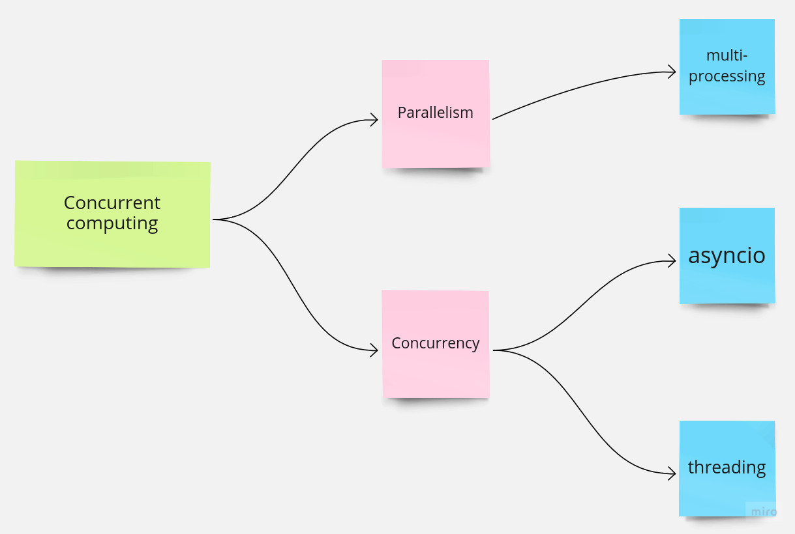

For a long time, I've struggled with creating a mental map of libraries `asyncio`, `threading` & `multiprocessing` and understanding how they relate to each other. As a result, I decided to spend my weekend researching concurrent computing in the Python world.

## Concurrent computing
* an umbrella term for concurrency, parallelism and asynchronous programming 

### Concurrency 
* multiple jobs take turns accessing the same shared resources 
* its goal is to prevent tasks from blocking each other
* example: launch multiple requests at once and switch among them once the responses come back
* Python `threading` and `asyncio` libraries

### Parallelism
* several tasks run side by side on multiple CPU cores
* its goal is maximizing the use of hardware resources 
* Python `multiprocessing` library 

### Libraries
#### `threading`
* Python threads are OS threads
* does not bypass the GIL, works within the contraints imposed by the GIL (GIL prevents multiple threads executing Python bytecode simultaneously in a single process) 
* threads shouldn't be used for CPU-intensive work, but for I/O-bound tasks
* threads within a process share the same memory space, meaning sharing data between threads is easier, but it also requires careful handling of shared resources to avoid conflicts 
* `asyncio` is the preffered choice for I/O-bound tasks in Python, but `threading` is useful when working with blocking libraries that are not designed to work with `asyncio` (`requests`, `urllib`, `sqlite` etc.) 

#### `asyncio`
* coroutines are special programming functions, which can be paused and resumed, allowing other coroutines to run in the meantime - they're not OS threads, so no thread management and complexity of synchronization
* require less memory than threads, it's easier to manage them than threads, possible to have many of them
* code can't be mixed with synchronous code 
* couroutines designed I/O-bound opreations, i.e. operations that need to wait for some external operation
* the core component that manages and schedules the execution of async tasks, and handles I/O events, timers and signals is event loop 

#### `multiprocessing`
* used for CPU-intensive tasks 
* enables to create separate processes, each with its memory space
* bypasses GIL and takes advantage of multiple CPU cores for parallel execution - tasks are launched side by side 
* relies on inter-process communication and process management mechanisms to distribute tasks among separate processes 

 
